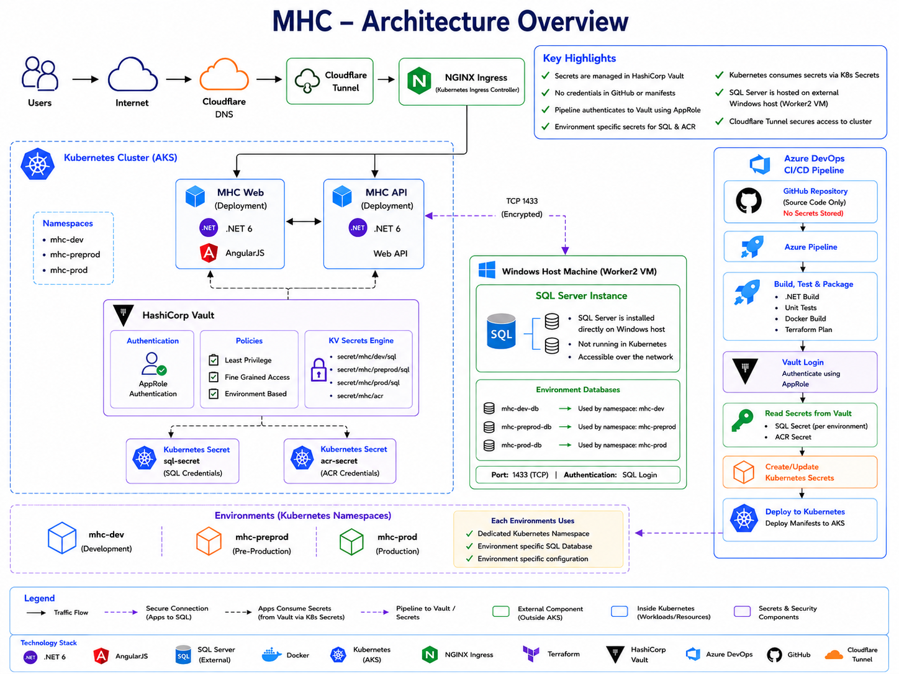
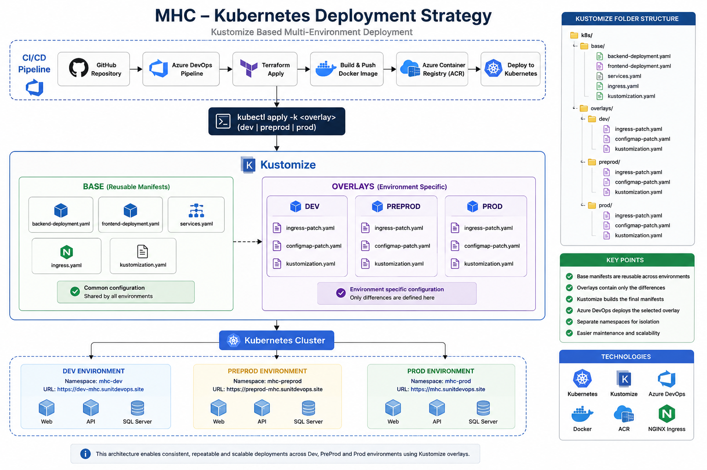
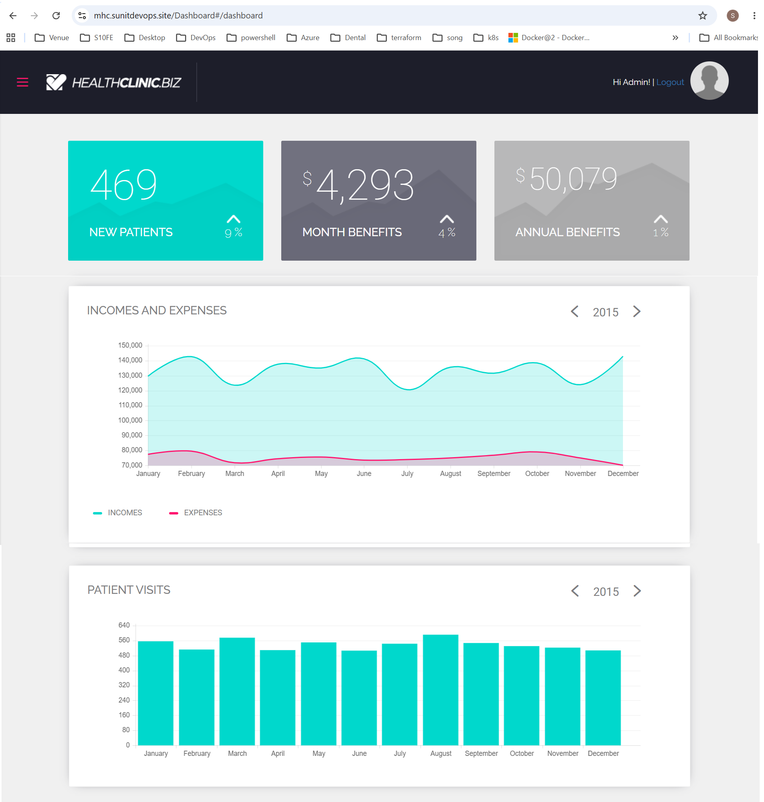
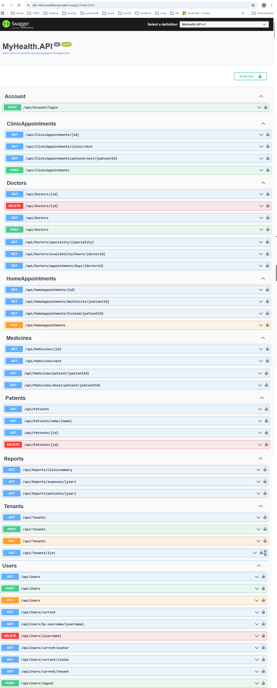
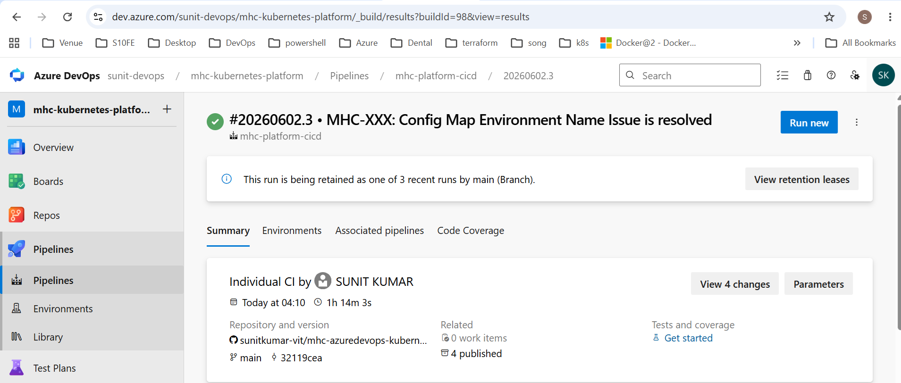
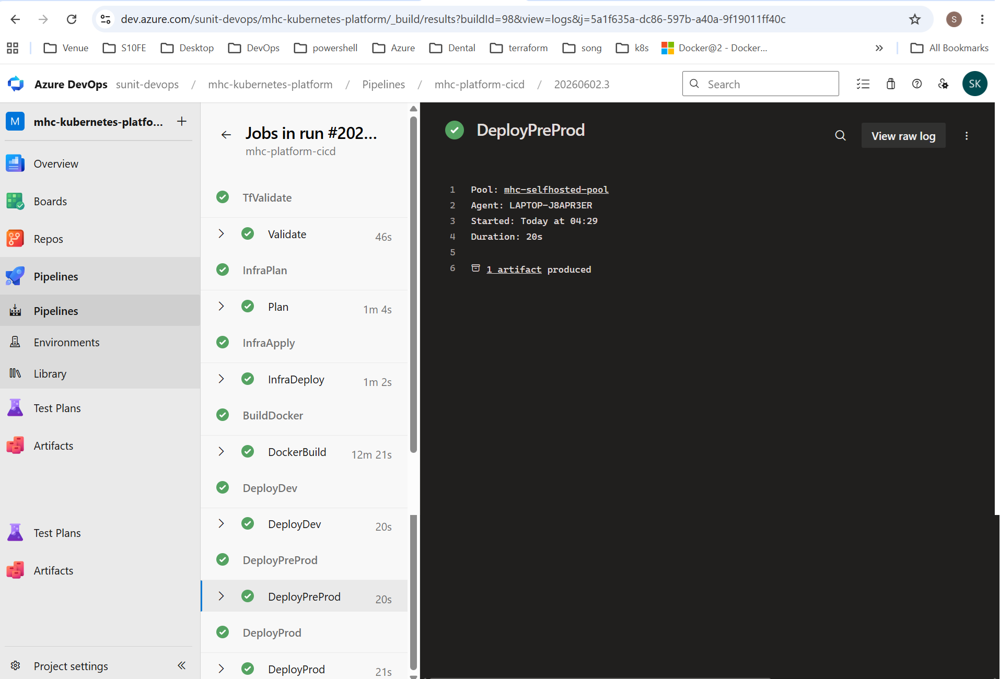
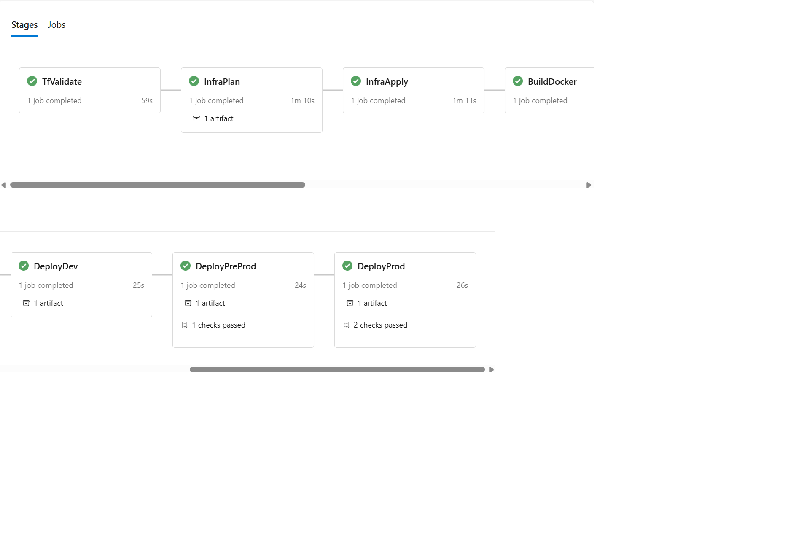
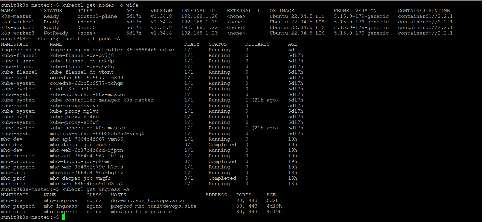

# My Health Clinic (MHC) - Cloud-Native Healthcare Platform

> A production-style healthcare application demonstrating Azure DevOps, Kubernetes, Terraform, Docker, Infrastructure as Code, and CI/CD best practices.

## Overview

MHC (My Health Clinic) is a cloud-native healthcare SaaS platform built to demonstrate enterprise-grade DevOps, Platform Engineering, Kubernetes orchestration, Infrastructure as Code, and multi-environment deployment strategies.

The project showcases end-to-end automation using Azure DevOps, Terraform, Docker, Kubernetes, SQL Server, NGINX Ingress, Cert Manager, and Cloudflare.

## Skills Demonstrated

- Azure DevOps Pipelines
- Kubernetes Administration
- Docker Containerization
- Infrastructure as Code (Terraform)
- GitHub Flow
- NGINX Ingress Management
- Environment Promotion Strategy
- SQL Server Deployment
- TLS Certificate Automation
- CI/CD Automation
- Self-hosted Build Agents
- Multi-Environment Deployments

## Technology Stack

| Category | Technology |
|-----------|------------|
| Frontend | AngularJS |
| Backend | ASP.NET Core 6 |
| Database | SQL Server |
| Containerization | Docker |
| Orchestration | Kubernetes |
| Ingress | NGINX Ingress Controller |
| CI/CD | Azure DevOps |
| Source Control | GitHub |
| Infrastructure as Code | Terraform |
| Certificate Management | cert-manager |
| TLS | Let's Encrypt |

## Infrastructure Components

- Self-hosted Azure DevOps Agent
- Kubernetes Cluster (Control Plane + Worker Nodes)
- NGINX Ingress Controller
- cert-manager
- Let's Encrypt
- SQL Server
- Persistent Volumes
- Cloudflare DNS
- GitHub Repository

## Solution Architecture

The My Health Clinic (MHC) platform is a cloud-native healthcare application deployed on Kubernetes using a multi-environment strategy (Dev, PreProd, and Prod).

The solution consists of:

- AngularJS Web Application
- .NET 6 REST API
- SQL Server Database
- NGINX Ingress Controller
- Kubernetes Deployments and Services
- Azure DevOps CI/CD Pipeline
- Terraform Infrastructure Provisioning

### Architecture Diagram

## Kubernetes Deployment Strategy

The MHC platform uses Kustomize overlays to manage environment-specific deployments while maintaining reusable base manifests.

### Benefits

- Reusable base Kubernetes manifests
- Environment-specific customization using overlays
- Reduced YAML duplication
- Simplified multi-environment deployments
- Better maintainability and scalability

### Folder Structure

k8s/
├── base/
└── overlays/
    ├── dev/
    ├── preprod/
    └── prod/

## Environment Strategy

The platform supports three deployment environments:

| Environment | Namespace |
|------------|-----------|
| Development | mhc-dev |
| PreProduction | mhc-preprod |
| Production | mhc-prod |

Each environment is deployed independently using Kubernetes namespaces and Azure DevOps deployment stages.

## Live Environments

| Environment | URL |
|------------|-----|
| Development | https://dev-mhc.sunitdevops.site |
| Pre-Production | https://preprod-mhc.sunitdevops.site |
| Production | https://mhc.sunitdevops.site |

## Screenshots

### Dashboard

### Swagger API

### Pipeline Overview

### Pipeline Execution

### Pipeline Stages

### Kubernetes Cluster

## CI/CD Flow Diagram

Developer
    ↓
GitHub
    ↓
Azure DevOps Pipeline
    ↓
Terraform Validation
    ↓
Terraform Plan
    ↓
Terraform Apply
    ↓
Docker Build
    ↓
Kubernetes Deployment
    ↓
Dev → PreProd → Prod

## CI/CD Pipeline

The Azure DevOps pipeline automates:

1. Terraform validation
2. Terraform plan
3. Terraform apply
4. Docker image build
5. Container registry push
6. Kubernetes deployment
7. Environment promotion
8. Manual approval gates

The pipeline deploys changes across Dev, PreProd, and Production environments.

## Key Features

- Three-environment deployment strategy (Dev, PreProd, Prod)
- Infrastructure as Code using Terraform
- Kubernetes-native deployments using Kustomize
- Automated CI/CD with Azure DevOps
- Dockerized application workloads
- Secure HTTPS using cert-manager and Let's Encrypt
- NGINX Ingress based routing
- SQL Server persistent storage
- Environment-specific configuration management
- Manual approval gates for higher environments
- Self-hosted build agents
- GitHub integrated workflow

## Future Enhancements

- Azure Kubernetes Service (AKS)
- Azure Container Registry (ACR)
- Azure Key Vault Integration
- Prometheus Monitoring
- Grafana Dashboards
- Application Insights
- Automated Rollback Strategy
- GitHub Actions Integration

## Author

Sunit Kumar

Azure DevOps | Kubernetes | Terraform | Cloud Platform Engineering

GitHub:
https://github.com/sunitkumar-vit